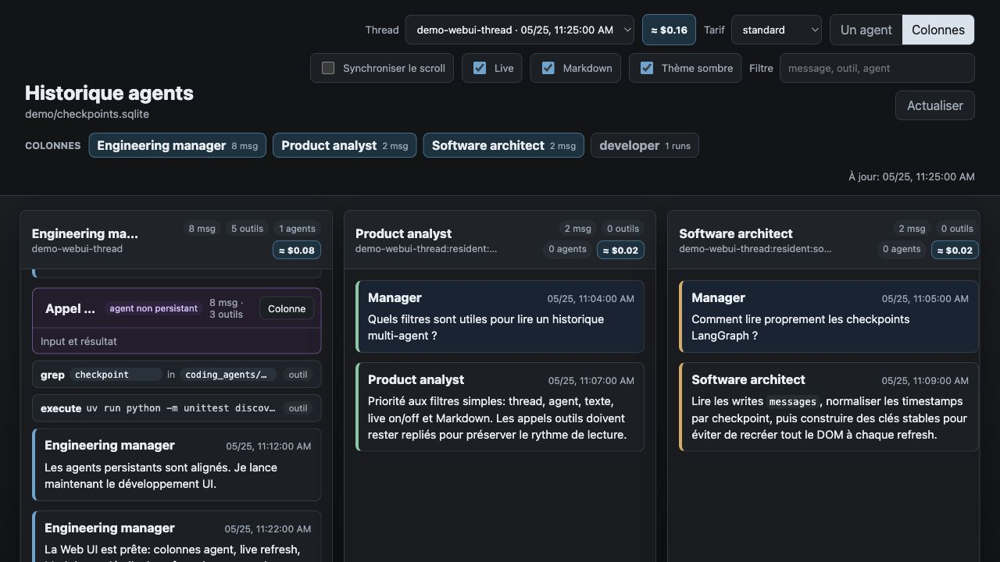
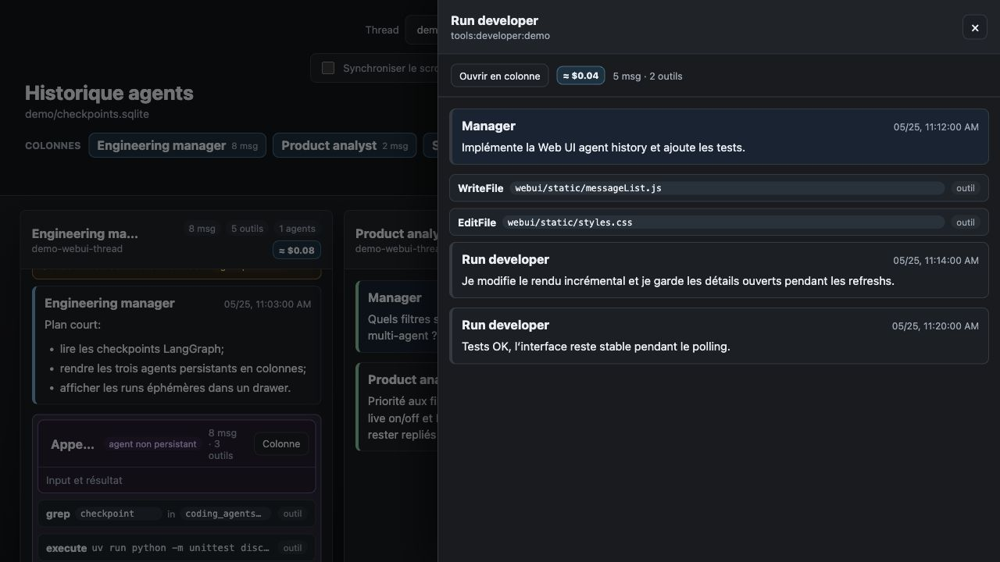
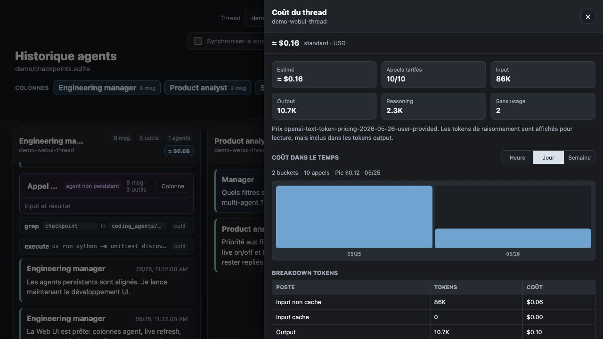

# coding-agents

`coding-agents` est une équipe locale d'agents de développement basée sur
LangChain Deep Agents.

L'outil sert à développer dans un repo avec:

- un `engineering-manager` qui pilote la conversation;
- deux agents persistants, `product analyst` et `software architect`;
- des agents spécialisés non persistants, par exemple developer, reviewer, QA;
- une Web UI locale pour lire l'historique, les outils appelés, les runs
  d'agents et les estimations de coût.

## Démarrage rapide

Installe les dépendances:

```bash
uv sync --locked
```

Configure au minimum une clé OpenAI:

```bash
export OPENAI_API_KEY="..."
export TAVILY_API_KEY="..."  # optionnel, utile pour les outils web
```

Lance une session agent pour développer dans ce repo:

```bash
uv run coding-agents \
  --root /Users/mickael/Documents/github/coding-agents \
  --mode implementation \
  --thread-id implementation-main
```

Dans un second terminal, lance la Web UI:

```bash
uv run python webui/server.py --db .coding-agents/checkpoints.sqlite --port 8766
```

Puis ouvre:

```text
http://127.0.0.1:8766
```

## Développer avec la Web UI

La Web UI aide à comprendre ce que font les agents pendant le développement.
Elle lit directement l'historique persistant LangGraph et se rafraîchit en live.



Tu peux:

- afficher un agent seul ou plusieurs agents en colonnes;
- activer/désactiver les colonnes depuis les noms d'agents;
- synchroniser le scroll quand les timestamps sont disponibles;
- garder le Markdown activé pour lire les réponses LLM;
- ouvrir les appels d'agents non persistants dans un panneau latéral;
- voir les appels outils sans devoir tout expand, notamment les chemins de
  fichiers et les commandes exécutées;
- suivre une estimation de coût par thread, colonne ou run.

Les appels outils et les payloads détaillés restent repliés par défaut pour
garder l'historique lisible. Les commentaires et réflexions restent visibles
quand ils contiennent du texte utile.

## Détails des runs

Quand le manager appelle un agent non persistant, par exemple `developer`, tu
peux ouvrir son transcript complet dans le panneau latéral ou l'ajouter comme
colonne temporaire.



## Coût estimé

Les coûts sont calculés à partir des tokens d'usage stockés dans les messages et
du catalogue de prix versionné dans `webui/pricing/`.



Le détail affiche:

- input, input cache, output et reasoning tokens;
- breakdown par modèle;
- breakdown par source;
- coût par heure, jour ou semaine;
- tarif sélectionné : standard, batch, flex ou priority.

## Commandes utiles

Lancer les tests:

```bash
uv run python -m unittest discover -s tests
```

Initialiser les artefacts de workflow sans lancer l'agent:

```bash
uv run coding-agents --init-only
```

Continuer une conversation existante:

```bash
uv run coding-agents \
  --root /Users/mickael/Documents/github/coding-agents \
  --mode implementation \
  --thread-id implementation-main
```

## Documentation

- [Development notes](development.md) pour la configuration, les checkpointers,
  les tests, l'API Python et les limites connues.
- [Development Agent Team Architecture](docs/development-agent-team-architecture.md)
  pour la spécification complète de l'équipe d'agents.
- [Web UI README](webui/README.md) pour les endpoints locaux de la Web UI.
