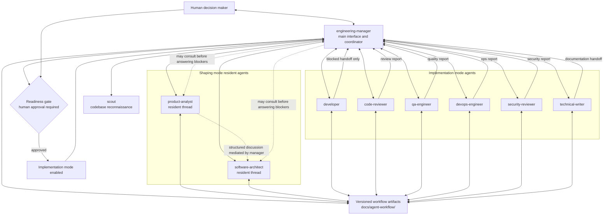

# Development Agent Team Architecture

Status: Draft v0.1

## Purpose

This document specifies an agent architecture for software development work.

The goal is to organize agents like a classical development team, with familiar
roles, communication patterns, decision points, and delivery gates. The system
should be able to take a product or technical request, shape it, prioritize it,
make architectural decisions, break it into tasks, implement it, review it, test
it, document it, and report back to a human decision maker.

The architecture is designed for LangChain Deep Agents. Deep Agents provide the
main orchestration harness, including planning, file context, subagent
delegation, memory, skills, and human-in-the-loop controls.

## Core Principle

The system behaves like a small autonomous software team, but with explicit
governance.

One primary agent acts as the engineering manager and tech lead. This agent is
the main interface with the human. It does not do all work itself. Instead, it:

- clarifies the request
- coordinates product and architecture shaping
- maintains the working state
- creates and updates the plan
- delegates bounded work to specialist agents
- arbitrates tradeoffs and disagreements
- validates readiness before implementation
- validates quality before delivery
- communicates progress and final results to the human

Specialized agents are called only when their role is useful.

## Framework Choice

The architecture uses Deep Agents as the top-level agent framework.

Deep Agents are appropriate because this system needs:

- long-running multi-step work
- task planning
- filesystem-backed context
- persistent project memory
- on-demand skills
- specialist subagents
- human approval gates

LangGraph may be introduced later for workflows that require precise graph
control, custom branching, retries, or deterministic fan-out/fan-in behavior.
LangChain tools and models remain the lower-level building blocks.

## Architecture Diagram



Communication rules:

- the human communicates with the engineering manager by default
- the engineering manager can consult any specialist agent
- the product analyst and software architect are resident agents contacted
  through manager-only tools: `ask_product_analyst` and
  `ask_software_architect`
- the product analyst and software architect may participate in a structured
  discussion mediated by the engineering manager
- the engineering manager calls the scout when a request requires actual
  codebase context, especially status, progress, readiness, or gap analysis
- the product analyst and software architect may reply with clarification
  questions when they need more information to produce a useful answer
- any specialist agent may reply with clarification questions when context is
  insufficient or when answering would require an undocumented assumption
- when specialists ask clarification questions, the engineering manager either
  answers from existing artifacts or escalates the question to the human
- when the engineering manager, product analyst, or software architect answers
  or clarifies an undocumented question or choice, they must update the relevant
  artifact so the clarification becomes durable project context
- developer agents do not ask the human questions directly by default
- blocked developers return a blocked handoff to the engineering manager
- the engineering manager may consult product or architecture before answering a
  developer blocker or escalating it to the human
- all agents communicate durable state through versioned workflow artifacts

## Team Roles

### engineering-manager

Primary coordinating agent.

Responsibilities:

- receive the human request
- identify whether the request is in shaping or implementation mode
- maintain the task list
- decide which specialist agents to consult
- synthesize specialist outputs
- keep artifacts up to date
- enforce readiness and delivery gates
- communicate with the human

The engineering manager is the only default interface. Other roles can be
addressed through it or explicitly invoked by the human.

### product-analyst

Product discovery and requirement agent.

Responsibilities:

- clarify the problem to solve
- identify target users and jobs-to-be-done
- define goals and non-goals
- capture functional requirements
- capture non-functional requirements
- identify edge cases
- propose acceptance criteria
- challenge scope and priority
- help define the MVP

### software-architect

Technical design agent.

Responsibilities:

- propose technical architecture
- identify constraints and dependencies
- compare implementation options
- surface risks and tradeoffs
- define module boundaries and contracts
- decide whether prototypes are needed
- create architecture decision records
- recommend technology choices

### scout

Fast codebase reconnaissance agent.

Responsibilities:

- inspect the actual repository before status or progress answers
- locate relevant files with `grep`, `glob`, and `ls`
- read key line ranges rather than whole files
- identify important types, functions, interfaces, and dependencies
- return compressed context that another agent can use without re-reading every
  file
- separate codebase facts from documentation claims
- avoid making product or architecture decisions

### developer

Implementation agent.

Responsibilities:

- implement one bounded task
- work only within the assigned ownership scope
- follow the provided task brief
- add or update tests when appropriate
- return a concise handoff with files changed, tests run, and remaining risks

Multiple developer agents may work in parallel only when their write scopes are
disjoint.

### code-reviewer

Review agent.

Responsibilities:

- review changes like a pull request reviewer
- prioritize bugs, regressions, missing tests, maintainability, and security
- report findings with severity, file references, and actionable fixes
- avoid style-only feedback unless it affects maintainability or conventions

### qa-engineer

Quality assurance agent.

Responsibilities:

- define the test strategy
- run or recommend unit tests, integration tests, smoke tests, and manual checks
- validate acceptance criteria
- report failures as corrective tasks
- identify residual risk when tests cannot be run

### devops-engineer

Build, CI, packaging, and environment agent.

Responsibilities:

- maintain scripts, build steps, CI configuration, and deployment concerns
- inspect failing checks
- manage environment setup
- propose deployment or release steps

### security-reviewer

Security and permission agent.

Responsibilities:

- review authentication, authorization, secrets, permissions, and user input
- review shell execution and filesystem access
- identify risky dependencies or unsafe operations
- require human approval for sensitive changes

### technical-writer

Documentation agent.

Responsibilities:

- update README files and technical documentation
- write changelog entries and release notes
- document usage, migration notes, and important decisions
- make documentation consistent with actual behavior

## Communication Model

Agents should communicate through structured artifacts, not informal hidden chat.

The main artifact types are:

- Task Brief
- Progress Update
- Review Report
- Decision Record
- Handoff Note
- Final Delivery Report

### Task Brief

Used when assigning work to an agent.

Required fields:

- objective
- context
- current decisions
- files or modules in scope
- files or modules out of scope
- constraints
- acceptance criteria
- expected output

### Progress Update

Used during longer work.

Required fields:

- completed
- in progress
- blocked
- next step
- decisions needed, if any

### Review Report

Used by reviewers.

Required fields:

- findings ordered by severity
- file and line references when available
- expected behavior
- observed risk or bug
- suggested fix
- residual test gaps

### Decision Record

Used for architectural or product decisions.

Required fields:

- decision
- context
- options considered
- selected option
- rejected options
- rationale
- consequences

### Handoff Note

Used when one agent passes work to another.

Required fields:

- current state
- changed artifacts
- unresolved questions
- known risks
- suggested next owner

### Final Delivery Report

Used by the engineering manager at the end of a delivery cycle.

Required fields:

- summary of completed work
- files changed
- tests run
- decisions made
- known risks
- follow-up tasks

## Working Modes

The system has two major modes:

- shaping
- implementation

The system starts in shaping mode unless the human explicitly provides a
ready-to-implement task with enough detail.

## Shaping Mode

Shaping mode exists before developers receive tasks.

Only these roles are active by default:

- engineering-manager
- product-analyst
- software-architect
- scout
- human decision maker

The purpose of shaping mode is to iterate on the product, prioritization, task
breakdown, architecture, and technical choices before implementation begins.

No code implementation should happen in shaping mode.

Allowed work in shaping mode:

- create or update specs
- create or update requirements
- compare product options
- compare technical options
- prioritize scope
- define MVP boundaries
- create architecture decision records
- create a proposed task breakdown

Disallowed work in shaping mode:

- assigning implementation tasks to developers
- editing production code
- running destructive operations
- deploying
- making irreversible technical decisions without human approval

### Interaction Styles

The human can iterate with the shaping team in two ways.

#### Orchestrated Mode

The human talks to the engineering manager. The engineering manager consults the
product analyst and software architect as needed, then returns a synthesized
answer.

This is the default interaction style.

The product analyst and software architect may respond to the engineering
manager with clarification questions instead of a final recommendation when the
available context is insufficient. The engineering manager should first try to
answer from existing artifacts. If the question requires a product decision,
architectural tradeoff, or missing business context, the engineering manager
escalates it to the human.

When the human asks where implementation stands, what is done, what remains, or
whether implementation is ready, the engineering manager must ask the scout to
inspect the actual codebase unless the human explicitly asks for docs-only
analysis. The manager then compares:

- documented state
- codebase state
- mismatches between docs and code
- recommended reconciliation steps

The same clarification rule applies to all specialist agents. They should not
make undocumented assumptions when context is missing. Instead, they should ask
the engineering manager a concise clarification question, name the assumption
they would otherwise have to make, and explain why it matters.

When the engineering manager, product analyst, or software architect answers or
clarifies an undocumented question or choice, the clarification must be written
to the relevant artifact. Product clarifications belong in `product-brief.md`,
`requirements.md`, or `prioritization.md`. Architectural clarifications belong
in `architecture-brief.md` or `decision-log.md`. Planning clarifications belong
in `task-breakdown.md` or `readiness-gate.md`.

#### Addressed Mode

The human can explicitly address a role through the engineering manager.

Examples:

- Ask the product analyst to challenge this priority.
- Ask the software architect to compare these two storage options.
- Run a product and architecture discussion on this feature.

This gives the human more control when a topic needs a sharper specialist point
of view.

Even in addressed mode, specialist questions are routed through the engineering
manager so that the conversation remains coherent and decisions are captured in
the correct artifacts.

## Shaping Loops

### Product Loop

Owner: product-analyst

Questions answered:

- What problem are we solving?
- Who are we solving it for?
- What is in scope?
- What is out of scope?
- What is the MVP?
- What are the acceptance criteria?
- Which features matter first?
- Which edge cases matter now?

Outputs:

- product brief
- requirements
- prioritization

### Architecture Loop

Owner: software-architect

Questions answered:

- What architecture fits the product shape?
- Which technical choices are structural?
- Which dependencies should be introduced or avoided?
- What risks are present?
- What contracts between modules are needed?
- What should be proven through a prototype?

Outputs:

- architecture brief
- decision records
- technical risk log

### Planning Loop

Owner: engineering-manager

Questions answered:

- What is the implementation order?
- Which tasks are independent?
- Which tasks are blocked by product or architecture decisions?
- Which agents will be needed during implementation?
- What is the Definition of Done?

Outputs:

- task breakdown
- readiness gate checklist
- implementation plan

## Living Artifacts

Shaping mode should maintain living documents rather than relying only on chat
history.

Shaping artifacts should live in a fixed repository folder so they are versioned,
reviewable, and easy for humans to inspect.

Default folder:

```text
docs/agent-workflow/
```

Recommended artifacts:

- product-brief.md
- requirements.md
- prioritization.md
- architecture-brief.md
- decision-log.md
- task-breakdown.md

Product and architecture discussions should not be persisted as full transcripts
by default. The system should persist structured outputs instead: current briefs,
requirements, prioritization notes, decision records, and short discussion
summaries when useful.

Each artifact can have one of these statuses:

- draft
- proposed
- approved
- frozen

Artifacts may be changed freely while in draft. Proposed artifacts are ready for
human review. Approved artifacts are accepted as the current basis for planning.
Frozen artifacts should not change unless the human explicitly reopens the
decision.

## Readiness Gate

Implementation cannot begin until the readiness gate passes.

The readiness gate should be enforced both by convention and, later, by code.

Convention:

- the engineering manager must not enter implementation mode until the gate is
  approved by the human

Future code enforcement:

- maintain a lightweight machine-readable checklist, such as
  `docs/agent-workflow/readiness-gate.yaml`
- tooling should verify that required fields are approved before developer
  agents receive tasks

The readiness gate passes only when:

- the product problem is clear
- the target user or usage context is defined
- the MVP is defined
- non-goals are documented
- core acceptance criteria are documented
- major architecture choices are made
- major technical risks are identified
- unresolved questions are either answered or explicitly deferred
- the task breakdown is clear enough for developer agents
- each implementation task has acceptance criteria
- the human approves the move to implementation mode

Rule:

```text
No Implementation Before Readiness Gate
```

## Implementation Mode

Implementation mode begins only after human approval of the readiness gate.

Active roles may include:

- engineering-manager
- developer
- code-reviewer
- qa-engineer
- devops-engineer
- security-reviewer
- technical-writer

The engineering manager assigns tasks to developers only after producing a
complete task brief.

Developer agents should be used for bounded implementation tasks. They should not
own product definition, architectural direction, or cross-cutting scope changes
unless explicitly assigned.

Developer agents should not ask the human questions directly by default. When a
developer is blocked, it should return a blocked handoff to the engineering
manager with the proposed question and the reason it is blocking.

If a developer or other implementation subagent needs access to files or modules
outside its approved write scope, it must request expanded access from the
engineering manager. The request must identify the requested paths, why the
current scope is insufficient, what it tried, risks of granting or denying the
access, and any alternative designs. The engineering manager may consult the
software architect and product analyst to decide whether the request is
technically and product-wise justified, whether the task should be split, or
whether another solution should be proposed.

The same rule applies to all specialist agents: code-reviewer, qa-engineer,
devops-engineer, security-reviewer, and technical-writer. They may ask the
engineering manager for clarification when they would otherwise have to make an
undocumented assumption.

The engineering manager then decides whether a question can be answered from
existing artifacts. If more context is needed, the engineering manager may
consult the product analyst or software architect before answering the specialist
or escalating the question to the human.

If the answer creates or changes project context, the engineering manager is
responsible for ensuring the relevant artifact is updated before work continues.

## Governance Rules

Human approval is required for:

- destructive filesystem operations
- major architecture changes
- database or data migrations
- permission or secret changes
- production deployment
- security-sensitive changes
- ambiguous product decisions with meaningful cost
- introducing major new dependencies
- changing frozen artifacts

Agents may decide autonomously for:

- local low-risk refactors
- targeted bug fixes
- test additions
- documentation updates
- implementation details that follow approved architecture
- choices already covered by project conventions

## Memory and State

The system should distinguish between different kinds of state.

### Permanent Project Memory

Examples:

- project conventions
- coding standards
- architecture principles
- approved decisions
- user preferences

Recommended representation:

- AGENTS.md files
- persistent memory files
- store-backed memory

### Session State

Examples:

- current plan
- current task list
- temporary discussion context
- open questions

Recommended representation:

- Deep Agents todo state
- thread-scoped backend state

### Working Files

Examples:

- draft notes
- intermediate reports
- temporary task outputs

Recommended representation:

- filesystem backend or state backend

### Validated Artifacts

Examples:

- approved product brief
- approved architecture brief
- decision records
- final task breakdown
- documentation

Recommended representation:

- versioned files in the repository

For version 0, approved memory and decisions should be stored as versioned
repository files, primarily under `docs/agent-workflow/` and in `AGENTS.md`
files when always-loaded guidance is needed. Temporary work should use
thread-scoped Deep Agents state.

A persistent StoreBackend is intentionally deferred. If the system later needs
long-term memory beyond repo artifacts, it can add a CompositeBackend with a
store-backed route such as `/memories/`.

Product and architecture conversation history are handled differently from
disposable subagent work. In version 0.1, the product analyst and software
architect are resident agents with stable thread IDs. Their conversation state
is checkpointed with a local SQLite LangGraph checkpointer by default, so it can
survive CLI restarts. This resident thread state is working memory; versioned
artifacts remain the durable source of truth.

Stable resident thread IDs:

```text
<manager-thread-id>:resident:product-analyst
<manager-thread-id>:resident:software-architect
```

For production or shared deployments, use a Postgres checkpointer instead of
SQLite. In both cases, repository artifacts remain the source of truth; the
checkpointer preserves working conversation history.

## Deep Agents Mapping

The recommended Deep Agents mapping is:

- engineering-manager as the main deep agent
- product-analyst as a resident deep agent contacted through
  `ask_product_analyst`
- software-architect as a resident deep agent contacted through
  `ask_software_architect`
- scout as a disposable compiled subagent contacted through the `task` tool for
  fast codebase reconnaissance
- developer as one or more disposable custom subagents
- code-reviewer as a custom subagent
- qa-engineer as a custom subagent
- devops-engineer as a custom subagent
- security-reviewer as a custom subagent
- technical-writer as a custom subagent

The main agent should use:

- TodoListMiddleware for planning and tracking
- FilesystemMiddleware for reading and writing artifacts
- manager-only tools for resident product and architecture conversations
- SubAgentMiddleware for disposable specialist delegation
- SkillsMiddleware for specialized workflows
- MemoryMiddleware or store-backed memory for persistent context
- HumanInTheLoopMiddleware for sensitive operations

## Custom Tools

Version 0 exposes these shared tools to the engineering manager, resident agents,
and disposable subagents:

- `web_search`: search the web for current information using Tavily
- `fetch_url`: extract readable content from a specific URL using Tavily

Version 0.1 also exposes these manager-only tools:

- `ask_product_analyst`: continue the resident product analyst conversation
- `ask_software_architect`: continue the resident software architect
  conversation

The scout subagent is configured with scoped reconnaissance tools:

- `ls`
- `read_file`
- `glob`
- `grep`
- `execute`
- `web_search`
- `fetch_url`

The scout `execute` tool should be limited to read-only reconnaissance commands.
It is not a general-purpose shell for implementation work.

Agents should use web tools when current external information, documentation, or
source verification is needed. Any summary that depends on web results should
include the relevant source URLs.

## Subagent Delegation Rule

Deep Agents subagents are stateless across calls. Therefore, every delegation
must include a complete packet of context.

Delegation packet template:

```text
Role:
Mission:
Current product context:
Current technical context:
Approved decisions:
Open questions:
Artifacts to read:
Files or modules in scope:
Files or modules out of scope:
Constraints:
Acceptance criteria:
Expected output format:
```

Incorrect pattern:

```text
Ask the architect to think about storage.
Later ask: what did you decide?
```

Correct pattern:

```text
Ask the architect to compare storage options for this product using the current
requirements, approved constraints, and decision log. Return a decision record
with options, recommendation, tradeoffs, risks, and migration concerns.
```

## Definition of Done

A task is done only when:

- acceptance criteria are satisfied
- relevant tests pass or limitations are documented
- code has been reviewed when code changed
- documentation has been updated when behavior changed
- important decisions are recorded
- risks and follow-up work are explicit
- the engineering manager has validated the final result

## Delivery Flow

The default end-to-end flow is:

1. Human submits a product or technical request.
2. Engineering manager starts shaping mode.
3. Product analyst clarifies product intent, scope, and acceptance criteria.
4. Software architect evaluates technical options and risks.
5. Engineering manager synthesizes the product and architecture outputs.
6. Human iterates with the shaping team until the artifacts are approved.
7. Engineering manager runs the readiness gate.
8. Human approves implementation mode.
9. Engineering manager assigns bounded tasks to developer agents.
10. Developer agents implement within their ownership scopes.
11. Code reviewer reviews the changes.
12. QA engineer validates behavior and tests.
13. Technical writer updates documentation when needed.
14. Engineering manager produces the final delivery report.

## Feature Stream Policy

Version 0 supports one active feature stream per workspace.

This keeps shaping, readiness validation, task breakdown, and implementation
coordination simple. The architecture may later support multiple concurrent
feature streams by introducing feature-scoped folders such as:

```text
docs/agent-workflow/features/<feature-id>/
```

## Open Design Questions

There are no open design questions in this draft.

Future iterations may reopen decisions around persistent memory, concurrent
feature streams, or automated readiness-gate enforcement.
