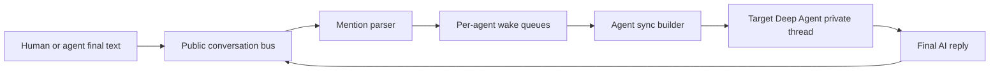

# Mention Router Specification

Status: design draft

This document describes an opt-in communication layer that lets a participant
write `@agent-id` in public text to wake a persistent Deep Agent. It is meant to
replace narrow resident-agent tools such as `ask_product_analyst` and
`ask_software_architect` where a shared brainstorm transcript is more natural
than a tool call.

## Recommendation

Build this as a public conversation bus beside the existing Deep Agents
checkpointer, not as another generated tool.

The public conversation bus owns only durable, participant-authored messages:
human messages and final agent replies. Each agent still owns its private Deep
Agents thread, including tool calls, tool results, todos, files, and other
agent-local state.

Do not merge raw full conversation history into the target agent on every
mention. Instead, keep a per-agent delivery cursor and append a compact
"conversation update" message to the target agent's private thread when it is
woken. This avoids duplicate history, preserves the agent's tool state, and
keeps token use bounded.

Use this for persistent `kind: deepagent` collaborators first. Keep the `task`
tool for disposable implementation subagents, because it gives better bounded
handoffs and lower context cost for software-development execution work.

## LangChain Message Identity

Participant identity should not be encoded in `role`.

LangChain chat messages use a semantic message type or role:

- `HumanMessage`: `type == "human"`
- `AIMessage`: `type == "ai"`
- `SystemMessage`: `type == "system"`
- `ToolMessage`: `type == "tool"`

Dict inputs often use OpenAI-style roles such as `user`, `assistant`, `system`,
and `tool`, which LangChain converts to those message classes.

Messages also support an optional `name` field, but the public transcript should
store participant identity explicitly as `author_id`. The runtime can project
that into `HumanMessage.name` when building the target agent's private input.

For a target agent, public events from other participants must not be
represented as plain assistant history without context. Assistant messages are
normally interpreted as the model's own previous output. Other participants
should be delivered as `HumanMessage(name="<author-id>")`, preserving the public
`author_id` in the message name. The target agent's own previous public replies
may remain in its private thread as normal AI messages because it actually
generated them.

## Goals

- Allow humans and persistent agents to wake agents by writing `@agent-id`.
- Keep one public transcript that records who said what.
- Keep private tool histories out of the public transcript.
- Let a mentioned agent understand the surrounding conversation.
- Prevent duplicate wakeups while an agent is already running.
- Preserve deterministic replay and inspectability.
- Support incremental adoption beside existing `tool` and `subagent` relations.

## Non-Goals

- Replacing the Deep Agents `task` tool for disposable workers in the first
  version.
- Making every message from every participant wake every agent.
- Storing tool calls, tool results, hidden reasoning, or todos in the public
  transcript.
- Treating the public transcript as the only source of agent-private memory.

## Conceptual Model

There are two histories:

1. Public conversation history
   - Owned by the mention router.
   - Contains only final participant messages.
   - Ordered by a monotonic sequence number.
   - Used for UI, mention detection, and agent synchronization.

2. Agent-private history
   - Owned by each Deep Agent's LangGraph thread.
   - Contains normal LangChain messages, tool calls, tool results, todos, and
     files.
   - Receives public conversation updates as explicit external context.



## Public Event Schema

The public transcript should be model-agnostic. Store data as runtime records,
not as LangChain messages.

```python
@dataclass(frozen=True)
class ConversationEvent:
    id: str
    team_id: str
    conversation_id: str
    seq: int
    created_at: str
    author_id: str
    author_kind: Literal["human", "agent", "system"]
    content: str
    mentions: tuple[str, ...]
    source_thread_id: str | None = None
    source_message_id: str | None = None
    metadata: Mapping[str, Any] = field(default_factory=dict)
```

Use `seq` as the authoritative order. Timestamps are useful for display, but
they are not reliable enough for concurrent merge semantics.

## Delivery State Schema

Each mentionable agent needs delivery state.

```python
@dataclass
class AgentDeliveryState:
    team_id: str
    conversation_id: str
    agent_id: str
    last_delivered_seq: int
    running: bool
    queued: bool
    queued_after_seq: int | None
    last_identity_refresh_seq: int
    token_estimate_since_identity_refresh: int
```

The important invariant is:

- `last_delivered_seq` advances only after the router successfully sends a
  conversation update covering events through a snapshot sequence.
- If an agent replies while other events were added concurrently, the cursor
  must not skip those concurrent events.

## Mention Resolution

The canonical mention form is `@<agent-id>`, where `<agent-id>` is the key from
`team.yaml`.

Agents may also define aliases. Aliases resolve to canonical agent ids before
queuing.

Suggested parser:

```text
(?<![\w.])@([A-Za-z][A-Za-z0-9_-]{1,63})(?![\w.-])
```

The parser should ignore mentions inside fenced code blocks and inline code when
possible. Unknown mentions should remain visible text and should not enqueue
anything.

The router should ignore self-mentions by default unless explicitly configured.
This prevents accidental self-trigger loops.

## Queue Semantics

Each mentionable agent has at most one active run and one collapsed queued run.

When a public event is appended:

1. Parse mentions from the event content.
2. Resolve mention aliases to canonical agent ids.
3. For each valid target, create or update a pending delivery.
4. If the target is idle, start a worker for it.
5. If the target is already running, set `queued = true` and update
   `queued_after_seq` to the newest event sequence.

When a worker starts:

1. Mark `running = true`.
2. Read a snapshot of the public transcript with `seq > last_delivered_seq`.
3. Render a conversation update for the target.
4. Invoke the target agent's private Deep Agents thread.
5. On success, advance `last_delivered_seq` to the snapshot's max sequence.
6. Extract the final AI reply and append it as a new public event.
7. Mark `running = false`.
8. If `queued = true` or new pending mentions exist, clear `queued` and start
   one more worker pass.

Multiple mentions that arrive while the agent is running collapse into a single
follow-up run.

Example:

```text
user: @agentA please think about the product shape.
agentA: This needs architecture input. @agentB what do you think?
user: @agentB also account for mobile.
user: @agentB and make the migration reversible.
user: @agentB check the cost impact too.
```

If `agentB` is already running after the first mention, the three later user
messages set one queued follow-up. When the first run finishes, `agentB` receives
one update that contains all public events that were not delivered during the
first run.

## Agent Synchronization

The sync builder should send deltas, not the full transcript every time.

Recommended target input shape:

```python
[
    SystemMessage(content="You are agentB. Other participants refer to you as @agentB."),
    HumanMessage(
        name="mickael",
        content="[42] @agentB also account for mobile.",
    ),
    HumanMessage(
        name="mickael",
        content="[43] @agentB and make the migration reversible.",
    ),
    HumanMessage(
        name="mickael",
        content="[44] @agentB check the cost impact too.",
    ),
    SystemMessage(
        content=(
            "You were mentioned in seq 42, 43, and 44. "
            "Reply with one final public message as agentB."
        ),
    ),
]
```

Identity system messages should be inserted on the first run and again whenever
the configured token threshold has passed since the last identity refresh.

The identity text should include:

- the agent's canonical id and display name;
- the mention form that wakes it;
- that public conversation updates include other participants as
  `HumanMessage(name="<author-id>")`;
- that it should write one final public reply unless it is explicitly blocked.

## Projection Rules

The public bus stores `author_id`; the sync builder renders participant events
as LangChain messages for each target agent.

Recommended MVP rendering:

- public events from other participants become
  `HumanMessage(name="<author-id>")`;
- include `seq` in the message content or metadata so references remain stable;
- the target agent's own previous public replies may become `AIMessage`;
- system router notices become `SystemMessage`;
- tool messages are never projected from the public bus.

## Final Reply Extraction

After a target agent run, append only one public message:

- Find the last AI/assistant message with textual content.
- Ignore tool calls, tool results, todos, and intermediate state.
- Store that text as `ConversationEvent(author_id=<target-agent-id>)`.
- Preserve source metadata such as private thread id and source message id for
  debugging.

If no final textual reply exists, append no public event and record a failed or
empty delivery result.

## Loop Controls

Mention cascades need hard limits.

Suggested defaults:

- one active run per agent;
- `max_parallel_agents: 2`;
- `max_cascade_turns: 8` per public append batch;
- `max_agent_failures: 2` before disabling automatic retries for that target;
- ignore self-mentions by default;
- require an explicit mention relation for agent-to-agent mentions.

When a limit is reached, append a router/system event or surface an operational
warning in the UI rather than silently dropping work.

## Team Configuration

Add a top-level `conversation` section and a new relation type, `mention`.

```yaml
conversation:
  enabled: true
  mention_prefix: "@"
  human_input:
    # For brainstorming rooms, use [] so a human message without mentions only
    # records history. For the current software team, keep the manager as the
    # default listener.
    default_targets:
      - engineering-manager
  mentions:
    require_relation_for_agent_mentions: true
    human_can_mention: all_deepagents
    ignore_self_mentions: true
    max_parallel_agents: 2
    max_cascade_turns: 8
  sync:
    mode: delta
    max_update_tokens: 12000
    summarize_when_over_tokens: 30000
    keep_recent_events: 40
    identity_refresh_after_tokens: 10000
```

Add optional per-agent conversation settings in the agent reference under
`team.yaml`.

```yaml
agents:
  product-analyst:
    kind: deepagent
    config: ./agents/product-analyst.mdc
    conversation:
      mentionable: true
      aliases:
        - product
        - product-analyst
      auto_reply: true
```

Add `mention` relations for agent-to-agent wake permissions.

```yaml
relations:
  - from: engineering-manager
    to: product-analyst
    relation: mention

  - from: engineering-manager
    to: software-architect
    relation: mention

  - from: product-analyst
    to: software-architect
    relation: mention
```

Validation rules:

- `conversation.enabled` defaults to `false`.
- `relation: mention` must reference declared agents.
- `relation: mention` must not define `tool_name` or `input_schema`.
- only `kind: deepagent` agents are mentionable by default;
- aliases must be unique after normalization;
- `human_input.default_targets` must contain mentionable agents;
- if `require_relation_for_agent_mentions` is true, an agent can wake only
  targets it has a `mention` relation to.

## Loader Changes

Add these model objects:

- `TeamConversationSettings`
- `MentionSettings`
- `ConversationSyncSettings`
- `AgentConversationSettings`

Extend:

- `TeamDefinition` with `conversation`;
- `AgentReference` or `AgentDefinition` with `conversation`;
- `RelationDefinition` validation to allow `mention`;
- docs for `team.yaml`.

The loader should keep parsing simple and deterministic. Runtime behavior,
queues, and persistence belong in the instantiator/runtime layer, not in the
loader.

## Runtime Integration

New runtime components:

- `ConversationStore`: append and read public events.
- `MentionParser`: parse and resolve mentions.
- `MentionRouter`: enqueue targets and own worker lifecycle.
- `AgentSyncBuilder`: render public deltas for a target agent.
- `PublicReplyExtractor`: extract one final public reply from agent results.
- `MentionAwareTeam`: wrapper around `InstantiatedTeam` that accepts human
  public messages and starts router dispatch.

The existing `AgentGraphRegistry` can continue to create per-agent graphs. The
router should call `registry.graph(target_agent_id)` with the target's stable
private thread id.

Thread ids should distinguish public mention participation from existing tool
relations. A simple pattern:

```text
<root-thread-id>:mention:<agent-id>
```

Existing `tool` relations can remain during migration.

## Storage

For SQLite checkpointers, store public conversation data in the same database as
the runtime manifest, using separate tables:

- `team_conversation_events`
- `team_conversation_agent_state`
- `team_conversation_deliveries`

For memory checkpointers, use an in-memory store. For Postgres, add the same
logical tables later.

The public store is separate from LangGraph checkpoints so it can be queried by
the Web UI without understanding every agent's private tool state.

## Web UI Implications

The Web UI should show the public conversation as a first-class room, then let
the user open an agent's private thread when debugging.

Useful display fields:

- public event sequence;
- author;
- mentions;
- delivery status per mentioned agent;
- whether an agent is running or has one queued follow-up.

## Migration Plan

1. Add config parsing and validation with no runtime behavior.
2. Add `ConversationStore`, `MentionParser`, and unit tests.
3. Add router state machine with fake graphs.
4. Add Deep Agents sync and reply extraction.
5. Add CLI or API path for public human messages.
6. Convert resident `ask_product_analyst` and `ask_software_architect` prompts
   to mention guidance.
7. Keep existing relation tools available behind config until mention routing is
   trusted.
8. Add Web UI public-room view.

## Test Plan

Unit tests:

- parse canonical mentions and aliases;
- ignore unknown mentions;
- ignore self-mentions by default;
- validate `relation: mention`;
- validate duplicate aliases;
- append public events without tool messages;
- collapse multiple mentions while a target is running;
- run a queued follow-up after the active run finishes;
- avoid skipping concurrent messages that arrived during a run;
- insert identity refresh after the token threshold;
- extract only the final AI reply.

Integration tests:

- human mentions one resident agent and receives one public reply;
- agent A mentions agent B, and agent B wakes through a mention relation;
- mention cascade stops at `max_cascade_turns`;
- existing `tool` relations still work while mention routing is enabled.

## Open Decisions

- Should `human_input.default_targets` default to the entrypoint agent for the
  existing CLI, or to an empty list for pure rooms?
- Should public transcript compaction be a stored summary event or only a
  per-agent sync optimization?
- Should aliases live in `team.yaml` agent references only, or can `.mdc`
  frontmatter define them too?
- Should mention routing stream intermediate agent replies to the UI, or append
  only final replies in v1?
- How should failed deliveries be surfaced to the human in CLI mode?
