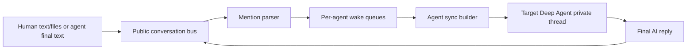

# Mention Router Specification

Status: design draft

This document describes an opt-in communication layer that lets a participant
write `@agent-id` in public text to wake a persistent Deep Agent. It is meant to
replace narrow resident-agent tools such as `ask_product_analyst` and
`ask_software_architect` where a shared brainstorm transcript is more natural
than a tool call.

## Recommendation

Build this as a public conversation bus beside the existing Deep Agents
checkpointer, not as another generated tool.

The user-facing UI that lets a human add new messages to the main public
conversation must be built as a separate web application under `src/webapp`.
It should be launched automatically when the selected team config defines a
top-level `conversation` section, and it must also support an explicit
command-line launch path for standalone use.

The public conversation bus owns only durable, participant-authored messages and
human-added shared file references: human messages, human-added public
attachments, and final agent replies. Each agent still owns its private Deep
Agents thread, including tool calls, tool results, todos, agent-local files, and
other agent-local state.

If a human adds files to the centralized conversation, those files become public
conversation attachments. Whenever another participant is mentioned, the router
must include the undelivered human-added files from the conversation snapshot in
that participant's private thread along with the conversation update.
Agent-private files are never promoted to the public bus by this rule.

Do not merge raw full conversation history into the target agent on every
mention. Instead, keep a per-agent delivery cursor and append a compact
"conversation update" message to the target agent's private thread when it is
woken. This avoids duplicate history, preserves the agent's tool state, and
keeps token use bounded.

Use this for persistent `kind: deepagent` collaborators first. Keep the `task`
tool for disposable implementation subagents, because it gives better bounded
handoffs and lower context cost for software-development execution work.

## LangChain Message Identity

Participant identity should not be encoded in `role`.

LangChain chat messages use a semantic message type or role:

- `HumanMessage`: `type == "human"`
- `AIMessage`: `type == "ai"`
- `SystemMessage`: `type == "system"`
- `ToolMessage`: `type == "tool"`

Dict inputs often use OpenAI-style roles such as `user`, `assistant`, `system`,
and `tool`, which LangChain converts to those message classes.

Messages also support an optional `name` field, but the public transcript should
store participant identity explicitly as `author_id`. The runtime can project
that into `HumanMessage.name` when building the target agent's private input.

For a target agent, public events from other participants must not be
represented as plain assistant history without context. Assistant messages are
normally interpreted as the model's own previous output. Other participants
should be delivered as `HumanMessage(name="<author-id>")`, preserving the public
`author_id` in the message name. The target agent's own previous public replies
may remain in its private thread as normal AI messages because it actually
generated them.

## Goals

- Allow humans and persistent agents to wake agents by writing `@agent-id`.
- Keep one public transcript that records who said what.
- Keep private tool histories and agent-private files out of the public
  transcript.
- Let a mentioned agent understand the surrounding conversation.
- Deliver human-added public conversation files to mentioned participants.
- Prevent duplicate wakeups while an agent is already running.
- Preserve deterministic replay and inspectability.
- Support incremental adoption beside existing `tool` and `subagent` relations.

## Non-Goals

- Replacing the Deep Agents `task` tool for disposable workers in the first
  version.
- Making every message from every participant wake every agent.
- Storing tool calls, tool results, hidden reasoning, todos, or agent-private
  files in the public transcript.
- Treating the public transcript as the only source of agent-private memory.

## Conceptual Model

There are two histories:

1. Public conversation history
   - Owned by the mention router.
   - Contains final participant messages and human-added shared file references.
   - Ordered by a monotonic sequence number.
   - Used for UI, mention detection, and agent synchronization.
2. Agent-private history
   - Owned by each Deep Agent's LangGraph thread.
   - Contains normal LangChain messages, tool calls, tool results, todos, and
     agent-local files.
   - Receives public conversation updates and human-added public files as
     explicit external context.



Human-added files in the centralized conversation are public attachments with
sequence ownership. Agent-private files created by tools or kept in a Deep Agent
thread remain private and must not be copied into the public bus automatically.

## Public Event Schema

The public transcript should be model-agnostic. Store data as runtime records,
not as LangChain messages.

```python
@dataclass(frozen=True)
class ConversationFileRef:
    id: str
    filename: str
    uri: str
    media_type: str | None = None
    size_bytes: int | None = None
    added_by: str | None = None

@dataclass(frozen=True)
class ConversationEvent:
    id: str
    team_id: str
    conversation_id: str
    seq: int
    created_at: str
    author_id: str
    author_kind: Literal["human", "agent"]
    content: str
    mentions: tuple[str, ...]
    attachments: tuple[ConversationFileRef, ...] = ()
    source_thread_id: str | None = None
    source_message_id: str | None = None
    metadata: Mapping[str, Any] = field(default_factory=dict)
```

Use `seq` as the authoritative order. Timestamps are useful for display, but
they are not reliable enough for concurrent merge semantics.

Attachments are durable references, not raw bytes in the event row. In the MVP,
only files added by humans to the centralized conversation should appear in
`attachments`. A file-only human add should still advance `seq`, either as an
empty-content event with attachments or as an attachment on the nearest human
message.

## Delivery State Schema

Each participating agent needs delivery state.

```python
@dataclass
class AgentDeliveryState:
    team_id: str
    conversation_id: str
    agent_id: str
    last_delivered_seq: int
    running: bool
    queued: bool
    queued_after_seq: int | None
    current_run_id: str | None
    current_snapshot_seq: int | None
    stop_requested: bool
    last_identity_refresh_seq: int
    token_estimate_since_identity_refresh: int
```

The important invariant is:

- `last_delivered_seq` advances only after the router successfully sends a
  conversation update covering events through a snapshot sequence.
- If an agent replies while other events were added concurrently, the cursor
  must not skip those concurrent events.
- A stopped run is not successful delivery. Its late result must be ignored, no
  public reply is appended for it, and `last_delivered_seq` must not advance for
  the stopped snapshot.

Conversation-level runtime controls should be persisted separately from each
agent's delivery cursor.

```python
@dataclass
class ConversationRuntimeState:
    team_id: str
    conversation_id: str
    mention_hook_enabled: bool = True
    max_cascade_turns: int | None = None
```

`max_cascade_turns = None` means unlimited. A numeric value caps automatic
agent-to-agent cascade turns for future dispatch batches and can be changed or
cleared from the UI. `mention_hook_enabled` is runtime UI state, not team
configuration; a configured conversation starts with the hook enabled unless the
user disables it.

## Mention Resolution

The canonical mention form is `@<agent-id>`, where `<agent-id>` is the key from
`team.yaml`.

Participating agents may also define aliases in their agent-level conversation
settings. Aliases resolve to canonical agent ids before queuing.

Mentionability is based only on conversation participation. If an agent is a
declared participant in the conversation, humans and other participating agents
can mention it. If it is not a participant, its `@agent-id` remains visible text
and does not enqueue a wakeup. There is no separate agent-to-agent mention
permission graph.

Suggested parser:

```text
(?<![\w.])@([A-Za-z][A-Za-z0-9_-]{1,63})(?![\w.-])
```

The parser should ignore mentions inside fenced code blocks and inline code when
possible. Unknown mentions should remain visible text and should not enqueue
anything.

The router must always ignore self-mentions. This prevents accidental
self-trigger loops and is not configurable.

## Queue Semantics

Each participating agent has at most one active run and one collapsed queued run.

When a public event is appended:

1. Store the event content and any human-added public file attachments under the
   next public `seq`.
2. Parse mentions from the event content.
3. Resolve mention aliases to canonical agent ids.
4. If the mention hook is disabled, record the mentions for display and stop;
   do not create deliveries.
5. For each valid target, create or update a pending delivery.
6. If the target is idle, start a worker for it.
7. If the target is already running, set `queued = true` and update
   `queued_after_seq` to the newest event sequence.

When a worker starts:

1. Mark `running = true`.
2. Assign `current_run_id`, read a snapshot of the public transcript with
   `seq > last_delivered_seq`, and store its max sequence as
   `current_snapshot_seq`.
3. Render a conversation update for the target.
4. Invoke the target agent's private Deep Agents thread.
5. On success, advance `last_delivered_seq` to the snapshot's max sequence.
6. Extract the final AI reply and append it as a new public event.
7. Clear `current_run_id`, `current_snapshot_seq`, and mark `running = false`.
8. If `queued = true` or new pending mentions exist, clear `queued` and start
   one more worker pass.

Multiple mentions that arrive while the agent is running collapse into a single
follow-up run.

When the mention hook is disabled, public events are still appended and mentions
may still be parsed for display, but no new deliveries are enqueued. Re-enabling
the hook affects future appends only; it must not automatically backfill
mentions written while the hook was disabled unless the user explicitly
requeues them.

When a user stops a running agent from the UI:

1. Set `stop_requested = true` for the current run and call the best available
   graph cancellation or interrupt mechanism.
2. If the invocation returns after it was stopped, ignore the result unless its
   `current_run_id` still matches the active run.
3. Append no public reply and do not advance `last_delivered_seq` for the
   stopped snapshot.
4. Mark the agent idle. If newer mentions were queued while it was running,
   immediately start the queued follow-up so the latest message does not wait on
   an intermediate answer.
5. If nothing newer is queued, leave the agent idle until a future mention or
   manual requeue.

Example:

```text
user: @agentA please think about the product shape.
agentA: This needs architecture input. @agentB what do you think?
user: @agentB also account for mobile.
user: @agentB and make the migration reversible.
user: @agentB check the cost impact too.
```

If `agentB` is already running after the first mention, the three later user
messages set one queued follow-up. When the first run finishes, `agentB` receives
one update that contains all public events that were not delivered during the
first run.

## Agent Synchronization

The sync builder sends deltas, not the full transcript every time. This is the
only supported mode: each update contains all public events with
`seq > last_delivered_seq` for the target agent.

The sync builder must not summarize, truncate, or rewrite participant-authored
content. If an undelivered delta cannot fit in the target model context, the
delivery should fail visibly with an operational warning rather than silently
editing human or agent messages.

Conversation updates must include the human-added files attached to all
undelivered public events in the snapshot. If a human added a file to the
centralized conversation before or during the event that mentions a participant,
the mentioned participant's private thread must receive that file through the
runtime's supported file input mechanism. The target should never be asked to
infer an unavailable file from its name alone.

Recommended target input shape:

```python
[
    SystemMessage(content="You are agentB. Other participants refer to you as @agentB."),
    HumanMessage(
        name="mickael",
        content="@agentB also account for mobile.",
        additional_kwargs={
            "attachments": [
                {
                    "id": "file_mobile_requirements",
                    "filename": "mobile-requirements.pdf",
                    "uri": "conversation://files/file_mobile_requirements",
                }
            ]
        },
    ),
    HumanMessage(
        name="mickael",
        content="@agentB and make the migration reversible.",
    ),
    HumanMessage(
        name="mickael",
        content="@agentB check the cost impact too.",
    ),
]
```

Identity system messages should be inserted on the first run and again whenever
the configured token threshold has passed since the last identity refresh.

The identity text should include:

- the agent's canonical id and display name;
- the mention form that wakes it;
- that public conversation updates include other participants as
  `HumanMessage(name="<author-id>")`;
- that human-added public conversation files are included when the agent is
  mentioned.

## Projection Rules

The public bus stores `author_id`; the sync builder renders participant events
as LangChain messages for each target agent.

Recommended MVP rendering:

- public events from other participants become
  `HumanMessage(name="<author-id>")`;
- human-added public files attached to undelivered events must be attached or
  materialized into the target agent's private thread using the runtime's file
  input mechanism;
- preserve `seq` in message metadata, when supported, so references remain
  stable without adding routing details to the visible message text;
- the target agent's own previous public replies may become `AIMessage`;
- tool messages and agent-private files are never projected from the public bus.

## Final Reply Extraction

After a target agent run, append only one public message:

- Find the last AI/assistant message with textual content.
- Ignore tool calls, tool results, todos, and intermediate state.
- Store that text as `ConversationEvent(author_id=<target-agent-id>)`.
- Preserve source metadata such as private thread id and source message id for
  debugging.

If no final textual reply exists, append no public event, record a failed or
empty delivery result, and surface an operational warning in the UI or logs.

## Loop Controls

Mention cascades need observable controls, but they should be unlimited by
default.

Suggested defaults:

- one active run per agent;
- mention hook enabled as runtime UI state;
- `max_parallel_agents: 2`;
- `max_cascade_turns: null` per public append batch, meaning unlimited;
- `max_agent_failures: 2` before disabling automatic retries for that target;
- always ignore self-mentions.

When a limit is reached, surface an operational warning in the UI or logs rather
than silently dropping work.

The UI must let the user set, change, or clear the cascade limit. Clearing the
limit returns to the default unlimited behavior.

## Team Configuration

Add a top-level `conversation` section. If the key is present, the public
conversation exists; there is no `enabled` flag. Conversation membership
determines mentionability; `mention` does not need its own relation type. The
mention prefix is always `@` and is not configurable.

```yaml
conversation:
  mentions:
    max_parallel_agents: 2
    max_cascade_turns: null
  identity_refresh_after_tokens: 10000
```

`human_input.default_targets` is optional and defaults to `[]`. It exists only
for entrypoint-style teams that want an unmentioned human message to wake a
manager agent. With the default empty list, a human message without mentions is
appended to the public transcript and wakes nobody.

Example: wake the engineering manager when a human posts a message with no
explicit `@agent-id` mention.

```yaml
conversation:
  human_input:
    default_targets:
      - engineering-manager
```

Add optional per-agent conversation settings in the agent reference under
`team.yaml`. The presence of this block enrolls the agent as a public
conversation participant. Any participant can be mentioned by humans and other
participants. If no aliases or other agent-level settings are needed, use an
empty `conversation: {}` block.

```yaml
agents:
  software-architect:
    kind: deepagent
    config: ./agents/software-architect.mdc
    conversation: {}
```

There is also no per-agent `auto_reply` flag. Reply behavior is the router's
core dispatch behavior: when a participant is explicitly mentioned, reached by
`human_input.default_targets`, or reached through a permitted cascade, the router
queues that participant and appends its final answer to the public transcript.
The mention hook, cascade limit, and stop controls govern whether queued work
runs.

```yaml
agents:
  product-analyst:
    kind: deepagent
    config: ./agents/product-analyst.mdc
    conversation:
      aliases:
        - product
        - product-analyst
```

Validation rules:

- if top-level `conversation` is absent, no public conversation is created; if
  it is present, the conversation is created;
- an agent is a conversation participant when its agent reference contains a
  `conversation` block;
- `mentions.max_cascade_turns` defaults to `null`; `null` means unlimited, and
  any configured integer must be positive;
- only `kind: deepagent` agents can be conversation participants by default;
- aliases must be unique after normalization;
- `human_input.default_targets` defaults to `[]`;
- `human_input.default_targets` must contain conversation participants;
- self-mentions are always ignored;
- mentions of declared agents that are not conversation participants must not
  enqueue deliveries.

## Loader Changes

Add these model objects:

- `TeamConversationSettings`
- `HumanInputSettings`
- `MentionSettings`
- `AgentConversationSettings`

Extend:

- `TeamDefinition` with `conversation`;
- `AgentReference` or `AgentDefinition` with `conversation`;
- docs for `team.yaml`.

The loader should keep parsing simple and deterministic. Runtime behavior,
queues, and persistence belong in the instantiator/runtime layer, not in the
loader.

## Runtime Integration

New runtime components:

- `ConversationStore`: append and read public events and human-added public file
  refs.
- `MentionParser`: parse and resolve mentions.
- `MentionRouter`: enqueue targets and own worker lifecycle.
- `ConversationRuntimeController`: update runtime controls such as the mention
  hook, cascade limit, and stop-running-agent requests.
- `AgentSyncBuilder`: render public deltas and attached human-added public files
  for a target agent.
- `PublicReplyExtractor`: extract one final public reply from agent results.
- `MentionAwareTeam`: wrapper around `InstantiatedTeam` that accepts human
  public messages and public file refs, then starts router dispatch.
- `ConversationWebAppLauncher`: starts the `src/webapp` conversation UI when a
  selected team has a top-level `conversation` section, and exposes the same
  launch path for the standalone CLI command.

The existing `AgentGraphRegistry` can continue to create per-agent graphs. The
router should call `registry.graph(target_agent_id)` with the target's stable
private thread id.

Thread ids should distinguish public mention participation from existing tool
relations. A simple pattern:

```text
<root-thread-id>:mention:<agent-id>
```

Existing `tool` relations can remain during migration.

## Storage

For SQLite checkpointers, store public conversation data in the same database as
the runtime manifest, using separate tables:

- `team_conversation_events`
- `team_conversation_files`
- `team_conversation_agent_state`
- `team_conversation_deliveries`
- `team_conversation_runtime_state`

For memory checkpointers, use an in-memory store. For Postgres, add the same
logical tables later.

The public store is separate from LangGraph checkpoints so it can be queried by
the Web UI without understanding every agent's private tool state.

## Web UI Implications

The Web UI that lets the user add new messages to the main public conversation
must live in `src/webapp` as its own web application. It is the conversation
composer and room UI, not an extension of the existing checkpoint/history
browser. It should talk to the mention-router runtime through explicit local
APIs instead of importing router internals directly.

Launch behavior:

- when the selected team config contains a top-level `conversation` section, the
  runtime should automatically launch `src/webapp` and pass it the active team
  id, conversation id, and API base URL;
- when the selected team config has no top-level `conversation` section, the web
  app must not be launched automatically;
- the same app must be launchable separately from the command line, for example
  through a `coding-agents webapp <team.yaml>` subcommand or an equivalent
  explicit CLI entry point.

The Web UI should show the public conversation as a first-class room, accept new
human-authored messages and public file attachments, then let the user open an
agent's private thread when debugging.

When any participating agent is currently thinking or replying to the public
conversation, the Web UI must display a concise activity hint directly above the
chat input. The hint should name the active participant when possible, for
example `software-architect is replying...`, and remain visible while that
participant has an active run or queued follow-up.

Clicking the activity hint must open a real-time activity panel for the active
participant. The panel should display live run activity such as streamed
thinking, tool calls, tool results, todo progress, private message history, and
delivery status. This panel is a debugging and observability surface only: none
of the private activity it displays is promoted into the public conversation
unless it becomes the agent's final extracted public reply.

Useful display fields:

- public event sequence;
- author;
- mentions;
- human-added public files attached to the event;
- delivery status per mentioned agent;
- whether an agent is running or has one queued follow-up;
- active participant activity state for the hint above the chat input.

Required controls:

- toggle the mention hook on and off without disabling the public transcript;
- set, change, or clear the cascade turn limit, with unlimited as the default;
- stop a currently running agent, showing a transient stopping state until the
  active run has been cancelled or its late result has been ignored;
- open the real-time activity panel by clicking the active-participant hint
  above the chat input.

Implementation references from the LangChain docs:

- [Deep Agents frontend overview](https://docs.langchain.com/oss/python/deepagents/frontend/overview):
  use the Deep Agents frontend patterns when rendering coordinator state,
  subagent streams, todo progress, and sandbox-like details from Deep Agents.
- [LangChain frontend overview](https://docs.langchain.com/oss/python/langchain/frontend/overview):
  use `useStream` as the preferred frontend integration pattern for streaming
  messages, tool calls, interrupts, history, queueing, and reconnect behavior
  from agent backends.
- [LangGraph frontend overview](https://docs.langchain.com/oss/python/langgraph/frontend/overview):
  model the runtime-facing API so the web app can consume graph state, streaming
  tokens, node outputs, and metadata through LangGraph-compatible streaming
  where possible.
- [LangGraph graph execution](https://docs.langchain.com/oss/python/langgraph/frontend/graph-execution):
  use node names, state keys, streaming content, committed `stream.values`, and
  `streamMetadata.langgraph_node` metadata to build progress and status views
  for active agent runs.

## Migration Plan

1. Add config parsing and validation with no runtime behavior.
2. Add `ConversationStore` with public file refs, `MentionParser`, and unit
   tests.
3. Add router state machine with fake graphs.
4. Add Deep Agents sync, human-added file delivery, and reply extraction.
5. Add CLI or API path for public human messages.
6. Scaffold the separate `src/webapp` conversation UI and standalone CLI launch
   path.
7. Automatically launch `src/webapp` when the selected team config has a
   top-level `conversation` section.
8. Convert resident `ask_product_analyst` and `ask_software_architect` prompts
   to mention guidance.
9. Keep existing relation tools available behind config until mention routing is
   trusted.
10. Add the Web UI public-room view for appending messages, attaching public
    files, controlling the mention hook, and inspecting run status.

## Test Plan

Unit tests:

- parse canonical mentions and aliases;
- ignore unknown mentions;
- ignore mentions of agents that are not conversation participants;
- always ignore self-mentions;
- validate duplicate aliases;
- default `max_cascade_turns` to unlimited;
- append public events without tool messages;
- persist human-added public file references on conversation events;
- include human-added public files in the mentioned participant's next private
  thread update;
- fail visibly instead of summarizing or truncating an oversized undelivered
  delta;
- keep appending public events while the mention hook is disabled without
  enqueueing mentioned agents;
- re-enable the mention hook without backfilling disabled-period mentions;
- collapse multiple mentions while a target is running;
- run a queued follow-up after the active run finishes;
- stop a running agent, ignore its late result, and start a queued follow-up if
  newer mentions exist;
- avoid skipping concurrent messages that arrived during a run;
- insert identity refresh after the token threshold;
- extract only the final AI reply.

Integration tests:

- human mentions one resident agent and receives one public reply;
- human adds a file to the centralized conversation, mentions an agent, and that
  agent receives the file in its private mention thread;
- agent A mentions agent B, and agent B wakes because it is a conversation
  participant;
- mention cascades continue without a turn cap by default;
- mention cascade stops at a configured `max_cascade_turns`;
- disabled mention hook lets users write messages with mentions without waking
  agents, then re-enabled hook wakes agents on later mentions;
- stopping a running agent lets a newer mention drive the next response without
  waiting for the stopped run's public answer;
- selecting a team config with a top-level `conversation` section starts the
  `src/webapp` launcher;
- selecting a team config without a top-level `conversation` section does not
  start the `src/webapp` launcher;
- launching the web app from the command line connects it to the selected team
  and lets a human append a public message;
- while a participant is thinking or replying, the web app shows a hint above
  the chat input and opens a real-time activity panel when the hint is clicked;
- existing `tool` relations still work while mention routing is enabled.

## Open Decisions

- Should aliases live in `team.yaml` agent references only, or can `.mdc`
  frontmatter define them too?
- Should mention routing stream intermediate agent replies to the UI, or append
  only final replies in v1?
- How should failed deliveries be surfaced to the human in CLI mode?
